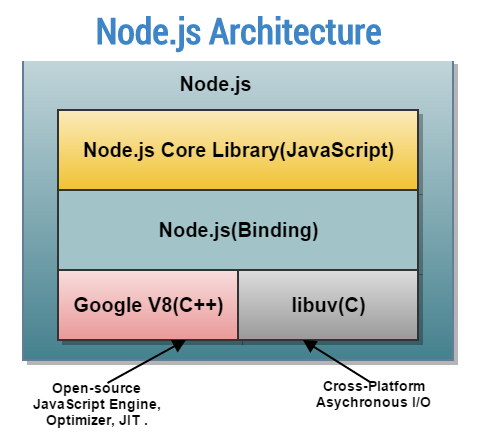

# Basics in NodeJS

## What is Node Js actually ?

* Node JS is not a language it is a runtime environment, just like how we run JS in Browser Environment.
* It is a tool, we use it build any projects but code in JS.
* Under the hood of any Browser, there is a engine that runs JS code, for example : 
    * V8 engine for Google Chrome
    * SpiderMonkey for Mozilla
    * JSCore for Safari
    * Chakra for Internet Explorer and now V8 for Edge
* Similarly Node uses V8 engine to run JS code outside of the Browser, additionally it uses few libraries and C++ bindings for internal process communication.

[References: JavaScript Engine](https://en.wikipedia.org/wiki/JavaScript_engine)

## How does Node.js work?

1. Node.js is a JavaScript Runtime:
    * Node.js is an open-source, cross-platform JavaScript runtime environment. It allows you to run JavaScript code outside of a web browser, on servers or local machines.

2. Event-Driven and Non-Blocking I/O:
    * Node.js uses an event-driven, non-blocking I/O model. This means that instead of waiting for tasks to complete before moving on to the next one, Node.js can handle multiple tasks simultaneously without blocking the execution of other operations.

3. Single-Threaded Event Loop:
    * Node.js operates on a single-threaded event loop. This event loop continuously listens for events and executes callback functions when events occur. It efficiently handles I/O operations by delegating them to the operating system, allowing the main thread to remain responsive.

4. Asynchronous Programming:
    * In Node.js, most I/O operations, such as file system operations, network requests, and database queries, are performed asynchronously. This means that the program does not wait for these operations to complete before moving on to the next task. Instead, callback functions are used to handle the results of asynchronous operations when they are ready.

## What is V8 Engine for Node.js?

1. JavaScript Engine:
    * The V8 engine is an open-source JavaScript engine developed by Google. It is written in C++ and is used to execute JavaScript code in web browsers and other environments.

2. Optimized for Performance:
    * The V8 engine is designed to optimize the execution of JavaScript code for performance. It uses various techniques, such as just-in-time (JIT) compilation and optimization of JavaScript code, to make execution faster and more efficient.

3. Used in Node.js:
    * Node.js leverages the V8 engine to execute JavaScript code outside of web browsers. When you run a Node.js application, the V8 engine compiles and executes the JavaScript code, making it possible to build fast and efficient server-side applications using JavaScript.

4. Integration with Node.js:
    * Node.js integrates the V8 engine into its runtime environment, allowing developers to write server-side JavaScript code that can take advantage of the performance optimizations provided by the V8 engine.

> In summary, Node.js uses the V8 engine to execute JavaScript code efficiently on servers or local machines. The V8 engine is a key component of Node.js, enabling it to deliver high-performance and scalable server-side applications.

## How does NodeJS executes a code using V8 engine?

1. Parsing JavaScript Code:
    * When you run a Node.js application, the JavaScript code is first parsed by the Node.js runtime environment.

2. Compilation by V8 Engine:
    * Once the code is parsed, it is handed over to the V8 engine for compilation. The V8 engine compiles the JavaScript code into machine code, which can be executed by the underlying hardware.

3. Execution of Machine Code:
    * The compiled machine code is then executed by the CPU. This is where the actual execution of the JavaScript code takes place.

4. Event Loop and Asynchronous Operations:
    * While the JavaScript code is being executed, Node.js manages asynchronous operations using its event loop mechanism. Asynchronous tasks, such as I/O operations, timers, and callbacks, are scheduled and executed by the event loop, allowing the main thread to remain responsive.

5. Handling I/O Operations:
    * When an asynchronous I/O operation is encountered, such as reading from a file or making a network request, Node.js delegates the operation to the underlying operating system, which handles it asynchronously. Once the operation is completed, a callback function is executed to handle the result.

6. Returning Results:
    * As the JavaScript code executes, results are returned to the calling code or passed to callback functions as needed. This allows the program to continue executing and processing data as it becomes available.

> In summary, Node.js leverages the V8 engine to compile and execute JavaScript code efficiently. The V8 engine compiles JavaScript code into machine code, which is then executed by the CPU. Node.js manages asynchronous operations using its event loop mechanism, ensuring that the main thread remains responsive while handling I/O operations and executing callback functions.

--- 

## More about NodeJS architecture:

Let’s delve into the major components of the Node.js V8 Engine and their roles:

1. V8 Engine:
    * Role: The V8 engine is the heart of Node.js. It’s responsible for executing JavaScript code efficiently.
    * Composition: V8 is written in approximately 30% JavaScript and 70% C++.
    Functionality:
        * Just-In-Time (JIT) Compilation: V8 translates JavaScript code into machine code at runtime, optimizing execution speed.
        * Memory Management: It handles memory allocation and garbage collection.
        * ECMAScript Compatibility: V8 ensures compatibility with ECMAScript standards.
        * Performance Optimization: V8 optimizes code execution by using techniques like inline caching and hidden classes.

2. libuv:
    * Role: libuv is a cross-platform library that provides asynchronous I/O operations and event-driven programming.
    * Composition: It’s entirely written in C++.
    * Functionality:
        * Event Loop: libuv manages the event loop, allowing Node.js to handle non-blocking tasks efficiently.
        * File System Operations: It provides APIs for file I/O, directory operations, and file watching.
        * Network Operations: libuv handles network sockets, DNS resolution, and other network-related tasks.
        * Child Processes: It manages child processes, enabling parallel execution.
        * Timers and Callbacks: libuv schedules timers and callbacks for asynchronous operations.

> These components work together to make Node.js powerful, efficient, and suitable for building scalable applications. 🚀

---

