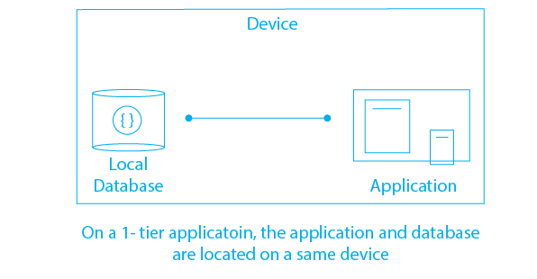

# Client Server Model

Client-Server Model in Website
* Definition: The client-server model is a fundamental architecture in web development, involving two main components: the client (user's device) and the server (remote computer hosting the website).
* Client (Frontend): 
    * Device (e.g., computer, smartphone) and web browser.
    * Responsibilities: Rendering UI, handling user interactions.
    * Technologies: HTML, CSS, JavaScript.
* Server (Backend):
    * Remote computer hosting the website.
    * Responsibilities: Handling requests, executing server-side logic, generating responses.
    * Technologies: Server-side languages (e.g., Node.js), databases (e.g., MongoDB).
* Request-Response Cycle:
    * User interacts with the website.
    * Client sends requests to the server.
    * Server processes requests, executes logic, and sends back responses.
    * Client renders the received content.
* Communication Protocols:
    * HTTP/HTTPS for client-server communication.
    * WebSockets for real-time bidirectional communication.
* Security (HTTPS):
    * Ensures secure data transmission using encryption.
    * Utilizes SSL/TLS protocols.

---

## Types of Client-Server Architecture: 1 Tier Model

*Ref: https://www.prepbytes.com/blog/dbms/dbms-architecture/*

* Definition: The 1-tier client-server model is the simplest architecture where both the client and server components reside on the same machine.
* Single Machine:
    * Client-side and server-side components coexist on the user's device.
* Responsibilities:
    * Client handles user interface and interactions.
    * Server manages data processing and application logic.
* Use Cases:
    * Typically used for small, standalone applications.
    * Common in desktop applications where both UI and logic run locally.
* Advantages:
    * Simplicity and ease of development.
    * Minimal network communication overhead.
* Disadvantages:
    * Limited scalability.
    * May not suit distributed or large-scale applications.
* Example: 
    * A simple calculator application where the UI and calculation logic both run on the user's machine.

---

## Types of Client-Server Architecture: 2 Tier Model

<!--  -->

*Ref: https://upload.wikimedia.org/wikipedia/commons/8/85/Client-Server_2-tier_architceture_-_en.png/*

* Definition: The 2-tier client-server model involves two main components - the client, responsible for the user interface, and the server, handling data processing and storage.
* Client Tier:
    * Responsible for the presentation layer and user interface.
    * Interacts directly with the user.
    * Executes application logic related to the user interface.
* Server Tier:
    * Manages data processing and storage.
    * Executes application logic related to data management.
    * Typically hosts a database for persistent data storage.
* Communication:
    * Communication between the client and server involves direct requests and responses.
    * The client sends requests for data or operations, and the server responds accordingly.
* Use Cases:
    * Commonly used for small to medium-sized applications.
    * Suitable for scenarios where data processing and user interface can be logically separated.
* Advantages:
    * Clear separation of concerns between user interface and data processing.
    * Easier to maintain than a 1-tier model.
* Disadvantages:
    * Limited scalability as both tiers are tightly coupled.
    * Challenges with concurrent user access in certain scenarios.
* Example:
    * A simple web application where the browser (client) interacts with a server hosting a database (server) to retrieve and store data.

In summary, the 2-tier client-server model introduces a separation between the user interface (client) and data processing (server), allowing for more organized development in comparison to the 1-tier model.

---

## Types of Client-Server Architecture: 3 Tier Model
* Definition: The 3-tier client-server model involves three main components - the client (presentation), application server (logic), and database server (data).
* Client Tier (Presentation):
    * Handles the user interface and user interactions.
    * Displays information and captures user input.
    * Executes presentation logic.
* Application Server Tier (Logic):
    * Manages application logic and business rules.
    * Processes user requests and performs necessary computations.
    * Acts as an intermediary between the client and the database.
* Database Server Tier (Data):
    * Stores and retrieves data.
    * Manages data integrity and security.
    * Executes database-related operations.
* Communication:
    * Clients communicate with the application server for application logic.
    * Application server communicates with the database server for data operations.
    * Promotes a clear separation of concerns.
* Use Cases:
    * Suitable for larger, more complex applications.
    * Enhances scalability and maintainability.
    * Allows for distributed development and specialization.
* Advantages:
    * Improved organization and modularity.
    * Easier maintenance and updates.
    * Scalability due to separation of concerns.
* Disadvantages:
    * Increased complexity compared to 2-tier models.
    * Potential for increased network latency.
* Example:
    * An e-commerce website where the browser (client) interacts with an application server for business logic, which in turn interacts with a database server for data retrieval and storage.

---
