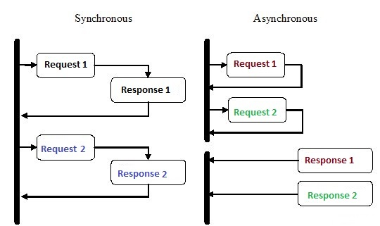
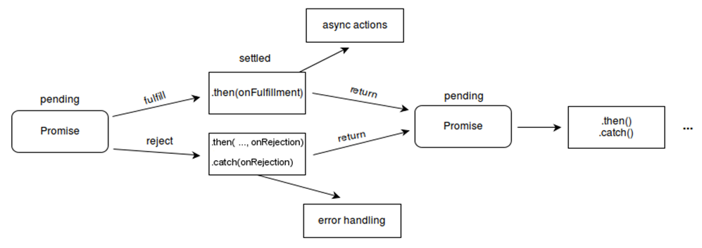

# Asynchronous Programming



* In sync operations, the process completes the task then it hands over back the main control, till then no other task can be performed.
* In async operations, the process is handed over to worker threads and they completes the task and returns the output to the process back.
* In this while the main process is free and hence it can perform other tasks.

## Promises

> Asynchronous programming can be handled with promises instead of creating a lot of callbacks in functions.

When there is a lengthy chain of callback functions used to implement numerous asynchronous tasks, it becomes difficult to maintain the application. We can utilise promise to address this issue. It is a neat technique to use JavaScript to do asynchronous programming.

A Promise in JavaScript is an object representing the eventual completion or failure of an asynchronous operation and its resulting value. Promises provide a cleaner and more organized way to write asynchronous code than using callbacks. They also allow for more advanced flow control and error handling.



### Here's an example of how to use Promises in JavaScript:

```js
function fetchUserData(userId) {
  return new Promise((resolve, reject) => {
    const url = `https://api.example.com/users/${userId}`;
    const xhr = new XMLHttpRequest();
    xhr.open('GET', url);
    xhr.onload = function() {
      if (xhr.status === 200) {
        const data = JSON.parse(xhr.responseText);
        resolve(data);
      } else {
        reject(new Error('Failed to fetch user data'));
      }
    };
    xhr.onerror = function() {
      reject(new Error('Network error'));
    };
    xhr.send();
  });
}

fetchUserData(123)
  .then((data) => {
    console.log('User data:', data);
  })
  .catch((error) => {
    console.error('Error:', error);
  });
```

In this example, we define a function fetchUserData that returns a Promise. Inside the Promise, we make an AJAX request to fetch user data from a server. If the request is successful, we call the resolve method and pass the resulting data as an argument. If the request fails, we call the reject method and pass an error object as an argument.

We then call the fetchUserData function with a user ID of 123, and use the then method to handle the resolved Promise with a callback function that logs the user data in then block and error in catch block.