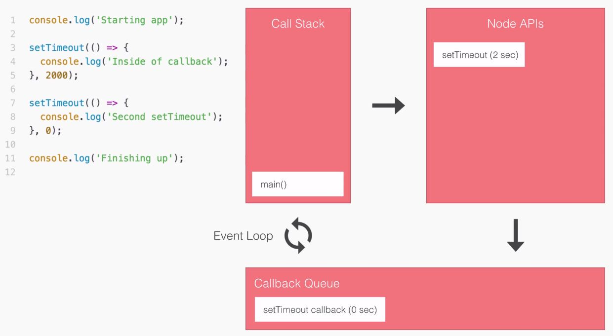

# Callbacks

## What is callbacks ?



* Callbacks are function which are passed as arguments in other functions and these callback is trigger when the task/request is completed.
* A triggered callback will contain, error if any, data and other options if specified.
* This callback returns the data to main process.

## Drawback of Callbacks

### Callback Hell

```
 getData(function(a) {
      getMoreData(a, function(b) {
        getMoreData(b, function(c) {
          getMoreData(c, function(d) {
            getMoreData(d, function(e) {
              // ...
            })
          })
        })
      })
    })

```
* Even though callbacks provide flexibility to handle async situation but it is a hard concept to understand.
* Using callbacks can lead code unreadability, it becomes difficult to keep track on things.

---
