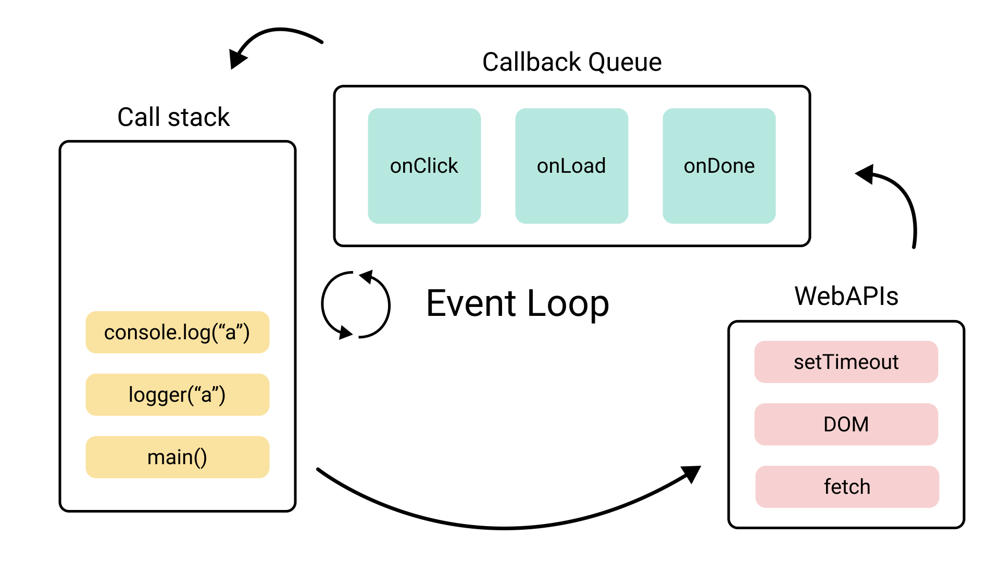

# JavaScript Event Loop

> The event loop in JS is a single main thread which is responsible for the execution of the code.

## Major components of JS event loop

* Main Thread (Event Loop) : responsible for execution of the flow
* Call Stack : the stack which hold the lastest part of the code which needs to be executed
* Callback Queues : holds the response generated from Web APIs once the task/function is completed
* Web APIs : runs the additional functionality required and handles the asynchronous aspect of the execution

---
