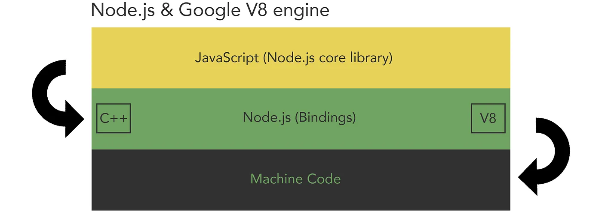

# V8 Engine

## JavaScript Engine

> The JavaScript engine is just one of the many components that make up a modern web browser. The browser engine is the main component responsible for rendering web pages, and it consists of several different modules that work together to process HTML, CSS, and JavaScript code.

## Components of JavaScript Engine

1. Parser:
The parser component of the engine is responsible for converting JavaScript source code into an Abstract Syntax Tree (AST). This is the first step in the execution process, and it enables the engine to analyze and optimize the code.

2. Interpreter:
The interpreter component of the engine reads the AST generated by the parser and executes the code. It does this by converting the AST into machine code, which can be executed by the computer's CPU.

3. Compiler:
The compiler component of the engine is responsible for optimizing the code by analyzing its structure and behavior. The engine uses a technique called "Just-in-time" (JIT) compilation to improve the performance of JavaScript code. This involves analyzing the code at runtime and generating optimized machine code that can be executed more quickly.

4. Garbage Collector:
The garbage collector component of the engine is responsible for managing memory usage in the JavaScript program. It monitors the objects created by the program and frees up memory that is no longer in use.

5. Profiler:
The profiler component of the engine is used to monitor the performance of JavaScript code. It provides detailed information about the execution time of different parts of the code, allowing developers to identify and optimize performance bottlenecks.

## Chrome V8 Engine

> JavaScript Chrome V8 engine is an open-source JavaScript engine developed by Google that powers the Google Chrome web browser and other web applications. It is written in C++ and is designed to be fast, efficient, and scalable. The V8 engine is made up of several components, each of which plays a specific role in the JavaScript execution process.

### Components of Chrome V8 Engine

1. NodeJs Core or JavaScript Core: 
This contains core of JS functionalities and utilities.

2. NodeJs Bindings: 
This helps to process functions from JS or NodeJS to C++.

3. Google V8 (C++):
This is the core of JS engine which helps to the run the code exactly.

4. libuv:
This is the pool of utilities or also worker threads which helps to run additional functionality or asynchronous tasks.

> Note: when talking only about JS (not NodeJS) the libuv does not exist in the engine and it is replaced by Browser Web APIs.

---
